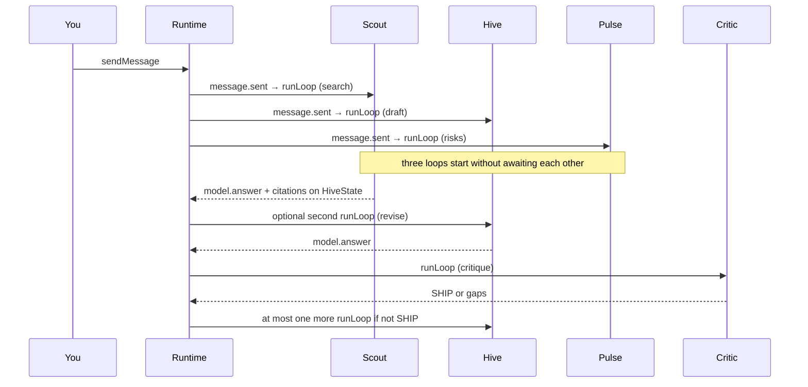

# Hive — JigJoy concurrent-agents hackathon

**Project:** Hive  
**Repo:** https://github.com/samkomedved319-dev/HiveSOURCE  
**Runtime:** [`@mozaik-ai/core`](https://github.com/jigjoy-ai/mozaik) `4.0.5`  
**App version:** `0.0.1`  
**Hackathon:** https://build.jigjoy.ai

Hive is a Windows Electron companion (chat, Buddy mascot, search, TTS, Telegram). Mozaik is the **brain**: one runtime in the Electron **main process** where Scout, Hive, and Critic stay joined, share `HiveState`, and think at the same time.

## How agents run concurrently

One `defineRuntime()` + `initializeRuntime({ state: new HiveState() })` lives in the main process. `You` (human), **Scout**, **Hive**, and **Critic** all `join()` that runtime and stay joined. A chat send is `sendMessage(text, humanId)`, which publishes `message.sent`.

Scout’s, Hive’s, and **Pulse’s** situation processors all match `message.sent` from someone else and each call `runLoop` **without awaiting it**. Those three loops start together. A slow search does not block Hive’s first draft or Pulse’s risk list. Critic does **not** sit in a step list — its processor matches Hive’s `model.answer` and only then starts its own `runLoop`. Sentry is an observer: it reacts to `function_call.started` and `InterceptionHandler` rewrites Hive/Operator loops when citations are faked or a command is destructive. Operator tools wait on a human Allow/Deny without blocking Scout/Hive. Coordination is semantic events + mutable `HiveState`, never `await agentA(); await agentB()`.

Buddy and Voice are observers: they never call `runLoop` or `sendMessage`. They only react (mascot mood / TTS).

## Participants and events

| Who | Kind | Starts `runLoop` when |
| --- | --- | --- |
| **You** | `createHuman` | never — renderer `hive.send` → `sendMessage` |
| **Scout** | `createAgent` + `web_search` tool | `message.sent` from someone else |
| **Hive** | `createAgent` + `get_citations` | `message.sent` from someone else **and** Scout `model.answer` (revise once) **and** Critic `model.answer` if not `SHIP` (revise once) |
| **Pulse** | `createAgent` | `message.sent` from someone else — **same instant as Scout and Hive** |
| **Critic** | `createAgent`, no search | Hive `model.answer` |
| **Operator** | `createAgent` + system tools | `message.sent` that clearly asks to open/run something |
| **Sentry** | observer + `InterceptionHandler` | `function_call.*`; rewrites fake citations / destructive commands |
| **Buddy** | observer human | `inference.started` / `function_call.started` / `model.answer` → mood |
| **Voice** | observer human | Critic `model.answer` containing `SHIP` → TTS |
| **Relay** | observer human | forwards lifecycle events to the renderer |



## How to run

Node 22+, bun or npm. From `HiveSOURCE`:

```bash
bun install
cp .env.example .env
# set OPENROUTER_API_KEY (free OpenRouter models)
bun run dev
```

Mozaik’s OpenAI-compatible runner is pointed at `https://openrouter.ai/api/v1` with `OPENROUTER_API_KEY`. Default model: `minimax/minimax-m3:free`.

## 60–90s demo script

1. Open Hive, sign in if asked, start a chat.
2. Type: **What is the JigJoy Mozaik hackathon deadline and main rule?**
3. Point at the swarm strip **and** the LIVE OPS log: **Scout, Hive, and Pulse** `runLoop` within milliseconds (`+0ms / +2ms / +4ms`).
4. Scout’s row appears with sources; Sentry logs the `web_search` tool call.
5. Hive’s draft shows, then **Critic** lights up off Hive’s `model.answer` (not a hardcoded “step 3”).
6. Optional: ask “open notepad” — Operator waits for Allow/Deny while the others keep going.

## Submission checklist

- [x] `@mozaik-ai/core` in package.json
- [x] 2+ agents + human joined (Scout, Hive, Critic + You)
- [x] overlapping `runLoop`s on one user message
- [x] shared `RuntimeState` (`HiveState`)
- [x] situation handlers, not a for-loop of agents
- [x] repo public
- [x] description + concurrency explanation (this file)
- [ ] screenshots or a short screen recording if possible
