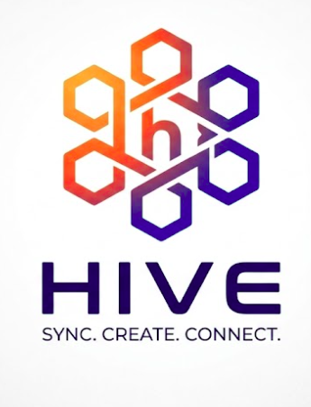
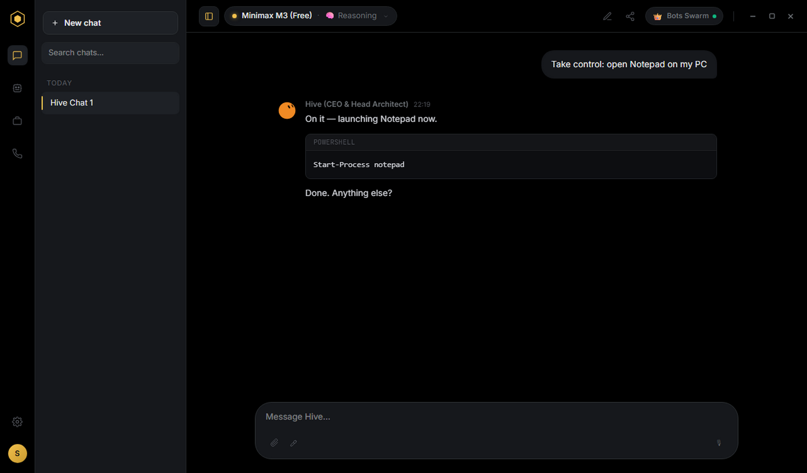
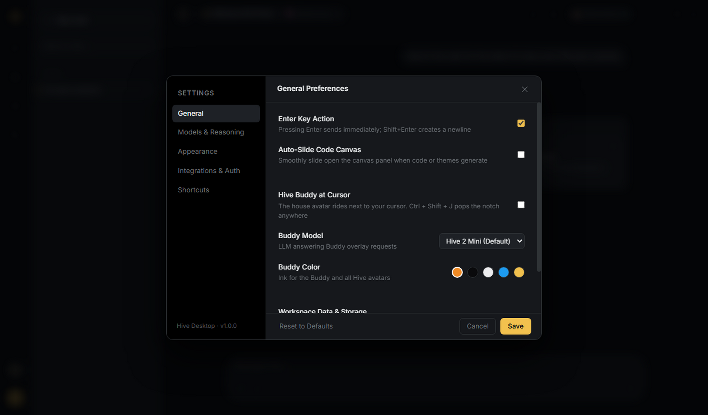

# ⬡ Hive — Grok-Style Desktop AI Companion

<p align="center">
  
</p>

<p align="center">
  <strong>Next-generation Windows-native AI Agent Bot & Desktop Companion.</strong><br/>
  Featuring interactive physics-based mascot companions, multi-model OpenRouter LLM orchestration, live web retrieval with citations, real-time voice calling, and Telegram integration.
</p>
<p align="center"><code>v0.0.1</code></p>

<p align="center">
  Built with <a href="https://github.com/jigjoy-ai/mozaik"><code>@mozaik-ai/core</code></a> for the <a href="https://build.jigjoy.ai">JigJoy concurrent-agents hackathon</a> — see <a href="HACKATHON.md">HACKATHON.md</a>.
</p>

<p align="center">
  
  
  
  
  
</p>

---

## ✨ Features

- 🤖 **Interactive Mascot Companion (Bloub Engine)**:
  - Physics-driven cursor following, dynamic facial expressions, eye-tracking, and responsive mood changes.
  - Floating Buddy mode (`BuddyOuter`), dynamic Notch docking (`BuddyNotch`), and speech bubble notifications.
  - Grok-inspired humorous and witty personality engine.

- 🧠 **Mozaik concurrent swarm** (`@mozaik-ai/core`):
  - Scout, Hive, and Pulse `runLoop` together on one message; Critic reacts to Hive; Sentry intercepts fake citations / destructive commands.
  - Live ops timeline shows overlapping start times. Details in [HACKATHON.md](HACKATHON.md).

- 🧠 **Multi-Model AI Intelligence (OpenRouter)**:
  - Zero-friction access to top free-tier models (Minimax M3, Nvidia Nemotron 3.5, Ling Flash, etc.).
  - Automatic model fallback and failover retry handling.
  - Custom API key overrides via user settings.

- 🌐 **Real-Time Live Web Search & Citations**:
  - Live search synthesis with DuckDuckGo fallback and OpenRouter web plugin.
  - Clickable citation pills with domain badges and modal deep-dive preview.

- 🎙️ **Voice Calls & Natural Speech**:
  - Edge Neural TTS engine with human-like prosody (`en-US-ChristopherNeural`).
  - WebRTC room token negotiation via LiveKit SDK.

- 📱 **Telegram Bot Integration**:
  - 2-way Telegram messaging bridge with 6-digit PIN authentication handshake.
  - Voice memo responses generated directly via neural audio synthesis.

- 🔐 **Hive website accounts (Supabase)**:
  - Same project as [samkomedved319-dev.github.io/hive](https://samkomedved319-dev.github.io/hive).
  - Sign in or create an account in the desktop app; waitlist profiles stay in sync.

- 🖥️ **Windows Native Experience**:
  - Frameless custom glass TitleBar with window snapping.
  - System Tray integration with minimize-to-tray & background persistence.
  - Global hotkey shortcut (`Ctrl+Shift+H`) to summon or dismiss from anywhere.

---

## 📸 Screenshots

| Chat & Web Search with Citations | Mascot Companion Notch |
| :---: | :---: |
|  |  |

| Floating Buddy Companion | Settings & Model Configuration |
| :---: | :---: |
|  |  |

---

## 🛠️ Tech Stack

- **Framework**: [Electron](https://www.electronjs.org/) + [Vite](https://vitejs.dev/)
- **UI & State**: [React 19](https://react.dev/), [Zustand](https://github.com/pmndrs/zustand), [Tailwind CSS v4](https://tailwindcss.com/)
- **Icons & Components**: [Lucide React](https://lucide.dev/), [Phosphor Icons](https://phosphoricons.com/), [shadcn/ui](https://ui.shadcn.com/)
- **Voice & Media**: `msedge-tts`, `livekit-client`, `livekit-server-sdk`
- **Animation**: [Motion](https://motion.dev/) (Framer Motion) + Custom 2D Canvas Bot Engine

---

## 🚀 Quick Start

### Prerequisites
- Node.js 22+ required
- Recommend [bun](https://bun.sh) as the verified install path (not Node 18/20)

### Installation

1. Clone the repository:
   ```bash
   git clone https://github.com/samkomedved319-dev/HiveSOURCE.git
   cd HiveSOURCE
   ```

2. Install dependencies:
   ```bash
   bun install
   ```

3. Configure environment variables (optional):
   ```bash
   cp .env.example .env
   ```
   Provide your `OPENROUTER_API_KEY` and `TELEGRAM_BOT_TOKEN` if you wish to use your own credentials.
   `VITE_SUPABASE_*` defaults to the Hive website project so one login works on web and desktop.
   Set `OPENROUTER_API_KEY` so the Mozaik swarm can infer (OpenRouter free models).

4. Start development mode:
   ```bash
   bun run dev
   ```
   This concurrently runs Vite on `http://localhost:5173` and compiles Electron main/preload processes.

---

## 📦 Build & Packaging

Build production bundles or generate a Windows installer (NSIS):

```bash
# Build Vite renderer and TypeScript main/preload
bun run build

# Package unpacked directory
bun run pack

# Build Windows installer (.exe)
bun run dist:win
```
The resulting installer and portable binaries will be saved in `release/`.

Pushing to `main` also runs **Windows installer** on GitHub Actions (`windows-latest`) and uploads the `.exe` as an artifact.

---

## 📁 Project Architecture

```
ProjectHive/
├── src/
│   ├── main/                 # Electron main process
│   │   ├── index.ts          # Window management, tray, shortcuts
│   │   ├── buddy-service.ts  # Mascot companion IPC coordination
│   │   ├── openrouter-service.ts # AI LLM stream & query handling
│   │   ├── search-service.ts # Web search retrieval & citation extraction
│   │   ├── telegram-service.ts # Telegram polling, PIN auth & messaging
│   │   ├── tts-service.ts    # Microsoft Edge neural voice synthesis
│   │   └── livekit-service.ts# WebRTC LiveKit room token generator
│   ├── preload/              # Secure IPC bridge
│   │   └── index.ts
│   └── renderer/             # React 19 Frontend
│       ├── App.tsx           # Main application root
│       ├── bot/              # Bloub animated procedural vector avatar engine
│       ├── companion/        # Grok personality & mascot scripts
│       ├── components/       # UI modular components
│       │   ├── chat/         # ChatView, MessageList, ChatInput, VoiceCall
│       │   ├── mascot/       # MascotWidget, BuddyNotch, BuddyOuter, BloubMascot
│       │   ├── layout/       # TitleBar, Sidebar, StatusBar, Modals
│       │   └── launch/       # Animated launch screen
│       └── stores/           # Zustand stores (chat, agents, settings)
├── tests/                    # 5-Tier comprehensive test suite
├── chrome-extension/         # Hive companion browser extension
└── website/                  # Landing page assets & site
```

---

## 🧪 Testing

The repository contains an extensive 5-tier test suite covering unit, boundary, pairwise, end-to-end, and adversarial scenarios:

```bash
# Run test suite
npx tsx scripts/run-e2e-tests.ts
```

---

## 📄 License

This project is licensed under the [MIT License](LICENSE).